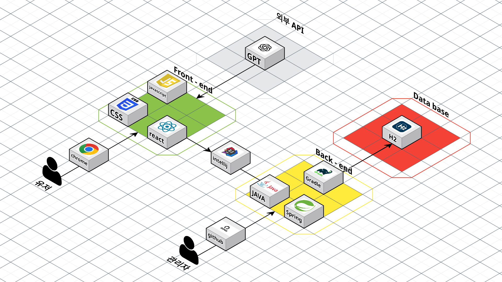

  <h1>미니 프로젝트 4차 - 부산/경남 10반</h1>
  <h3>📖 도서관리시스템 개발 📖</h3>

 

  <a href="https://github.com/Sihyeon0123/AIVLE-mini-project-4/">GitHub</a>
  &nbsp; | &nbsp; 
  <a href="https://www.notion.so/AIVLE-School-4-2bf994ebe25d80e386a7d101c97ffd0d">Notion</a>
  &nbsp; | &nbsp; 
  <a href="https://www.figma.com/design/r3jpdOz2xgUvo7j7NIQbUV/4%EC%B0%A8-%EB%AF%B8%EB%8B%88?node-id=0-1&p=f/">Figma</a>
  &nbsp; | &nbsp; 
  <a href="https://docs.google.com/spreadsheets/d/1El2XurvM0hBwo7mui5dlEC87zFCsDXSg/edit?gid=1349883987#gid=1349883987">API 명세서</a>

## ✍️ 프로젝트 개요

---

- **프로젝트 명:** 
- **프로젝트 기간:** 
- **KT Aivle School 4차 미니프로젝트**

## ✍️ 프로젝트 소개

---

### 프로젝트 배경

---

## 🚀 프로젝트 목표

- 

---

## 📌 주요 기능

- 

---

## 🧑‍💻 팀원 소개

|       **양시현**        |           **박기준**            |     **배교성**     |        **신다훈**        |
|:--------------------:|:----------------------------:|:---------------:|:---------------------:|
|        팀장, BE        |            팀원, FE            |     팀원, BE      |        팀원, FE         |
| 회원 관리 API, JWT 토큰 인증 |  |  도서 및 카테고리 API  |  |

| **이연호** |           **이정제**            |     **이태훈**      |        **장석진**        |
|:-------:|:----------------------------:|:----------------:|:---------------------:|
| 팀원, FE  |            팀원, FE            |      팀원, BE      |        팀원, FE         |
|         |  | 도서 및 카테고리 API |  |

---
## ⚙️ 기술 스택

<table>
    <thead>
        <tr>
            <th>분류</th>
            <th>기술 스택</th>
        </tr>
    </thead>
    <tbody>
        <tr>
            <td>
                  
프론트엔드

            </td>
            <td>
                  
                  
                  
            </td>
        </tr>
        <tr>
            <td>
                
백엔드

            </td>
            <td>
                
                
                
            </td>
        </tr>
        <tr>
            <td>
                
외부 API

            </td>
            <td>
                
            </td>
        </tr>
        <tr>
            <td>
                
협업 툴

            </td>
            <td>
                
                
                
            </td>
        </tr>
    </tbody>
</table>

---

## 🔨 시스템 아키텍처

---

## 📊 ERD

---